# SalesforceReact Architecture

This document provides a deep technical dive into the architecture of the SalesforceReact library, including design patterns, component relationships, and data flow.

## Table of Contents

- [Architectural Overview](#architectural-overview)
- [Bridge Pattern](#bridge-pattern)
- [Component Hierarchy](#component-hierarchy)
- [Authentication Architecture](#authentication-architecture)
- [Data Flow Patterns](#data-flow-patterns)
- [Lifecycle Management](#lifecycle-management)
- [Threading Model](#threading-model)
- [Storage Architecture](#storage-architecture)

## Architectural Overview

SalesforceReact implements a bridge architecture that connects React Native JavaScript code with native Android Salesforce SDK functionality. The library sits at the intersection of three major systems:

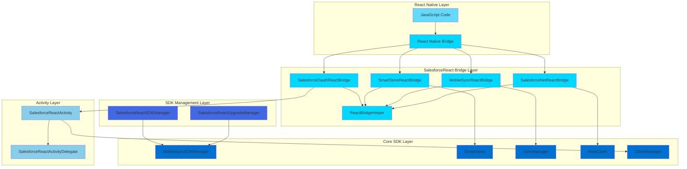

### Key Design Principles

1. **Separation of Concerns**: Each layer has a distinct responsibility
2. **Singleton Pattern**: SDK managers and stores use singletons for global access
3. **Callback Pattern**: Asynchronous operations return results via callbacks
4. **Delegation Pattern**: Activity delegates lifecycle management
5. **Factory Pattern**: SDK manager creates and registers bridge modules

## Bridge Pattern

### React Native Bridge Communication

The React Native bridge enables bidirectional communication between JavaScript and native code:

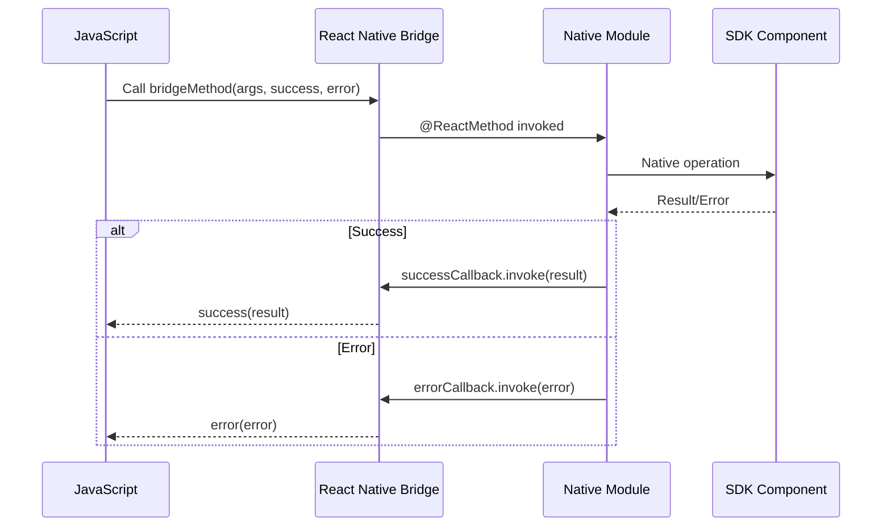

### Bridge Module Registration

Bridge modules are registered via ReactPackage:

```java
public ReactPackage getReactPackage() {
    return new ReactPackage() {
        @Override
        public List<NativeModule> createNativeModules(
                ReactApplicationContext reactContext) {
            List<NativeModule> modules = new ArrayList<>();
            modules.add(new SalesforceOauthReactBridge(reactContext));
            modules.add(new SalesforceNetReactBridge(reactContext));
            modules.add(new SmartStoreReactBridge(reactContext));
            modules.add(new MobileSyncReactBridge(reactContext));
            return modules;
        }
        
        @Override
        public List<ViewManager> createViewManagers(
                ReactApplicationContext reactContext) {
            return Collections.emptyList();
        }
    };
}
```

### Bridge Helper Pattern

`ReactBridgeHelper` provides utility methods for data conversion between React Native and Java types:

- **JavaScript → Java**: `ReadableMap`/`ReadableArray` → `Map`/`List`
- **Java → JavaScript**: `JSONObject`/`JSONArray` → String (serialized for `JSON.parse()`)

This conversion is necessary because React Native bridge doesn't support direct JSON object transfer. The pattern is:

1. Java serializes `JSONObject` to String
2. Callback passes String to JavaScript
3. JavaScript calls `JSON.parse(result)` to reconstruct object

## Component Hierarchy

### Class Diagram

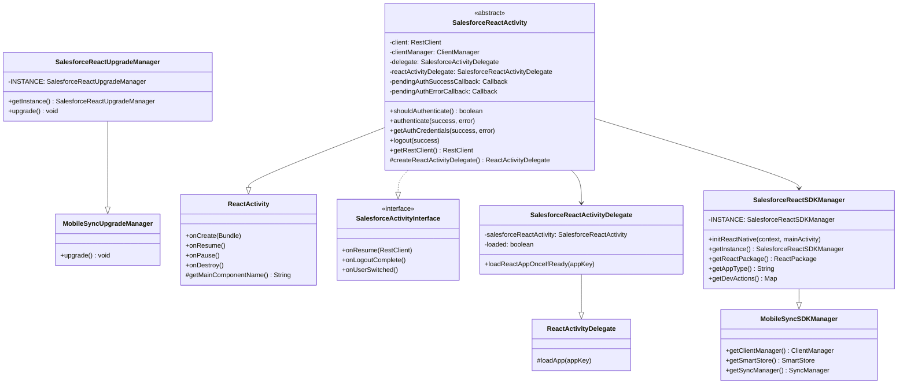

### Bridge Modules Hierarchy

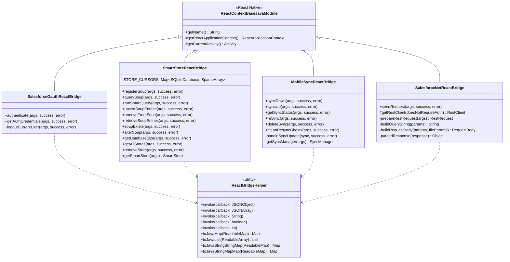

## Authentication Architecture

### Authentication State Machine

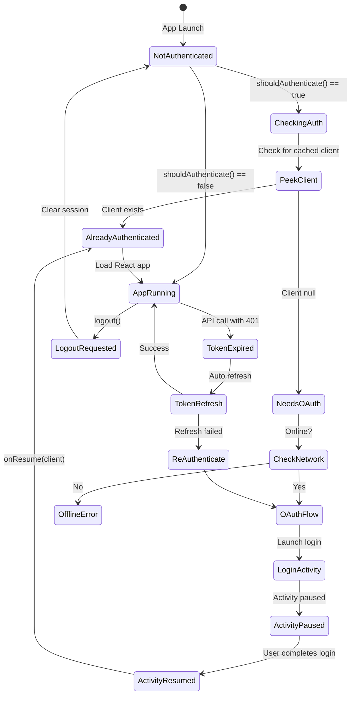

### Pending Callback Mechanism

The authentication flow uses a sophisticated callback coordination mechanism to handle race conditions between OAuth and activity lifecycle:

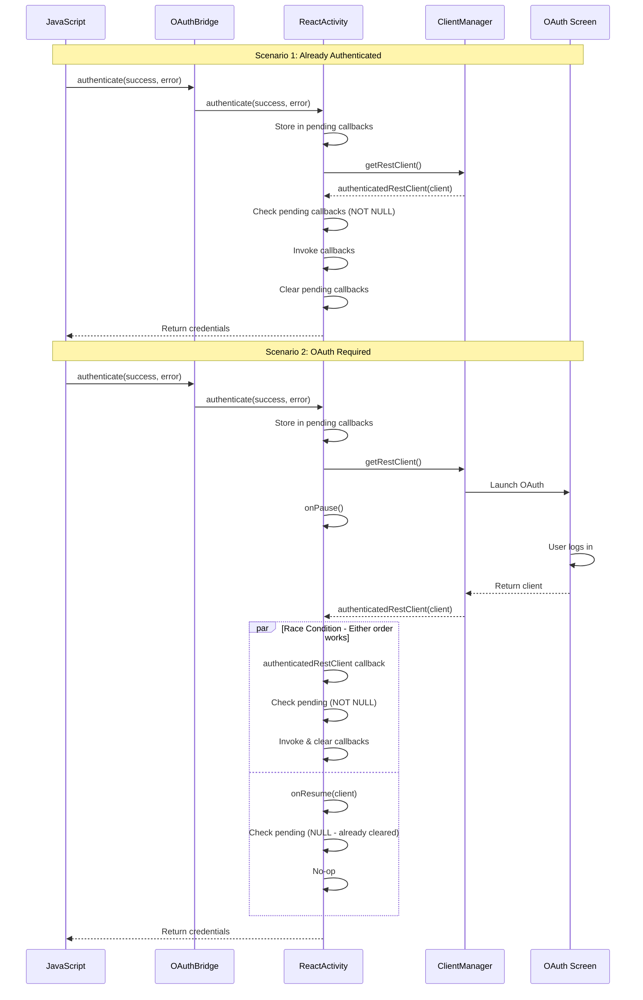

The key insight: **Both `authenticatedRestClient()` callback and `onResume()` check and clear pending callbacks atomically. Whichever runs first invokes them; the other sees null and does nothing.**

### Authentication Code Flow

```java
// Store callbacks for both scenarios
pendingAuthSuccessCallback = successCallback;
pendingAuthErrorCallback = errorCallback;

clientManager.getRestClient(this, new RestClientCallback() {
    @Override
    public void authenticatedRestClient(RestClient client) {
        setRestClient(client);
        
        // ALWAYS invoke callbacks here (both scenarios)
        if (pendingAuthSuccessCallback != null) {
            getAuthCredentials(pendingAuthSuccessCallback, pendingAuthErrorCallback);
            pendingAuthSuccessCallback = null;
            pendingAuthErrorCallback = null;
        }
    }
});

// onResume also checks and clears (race condition safe)
@Override
public void onResume(RestClient c) {
    setRestClient(clientManager.peekRestClient());
    
    // Only invoke if authenticatedRestClient hasn't run yet
    if (pendingAuthSuccessCallback != null) {
        getAuthCredentials(pendingAuthSuccessCallback, pendingAuthErrorCallback);
        pendingAuthSuccessCallback = null;
        pendingAuthErrorCallback = null;
    }
}
```

## Data Flow Patterns

### SmartStore Query Flow

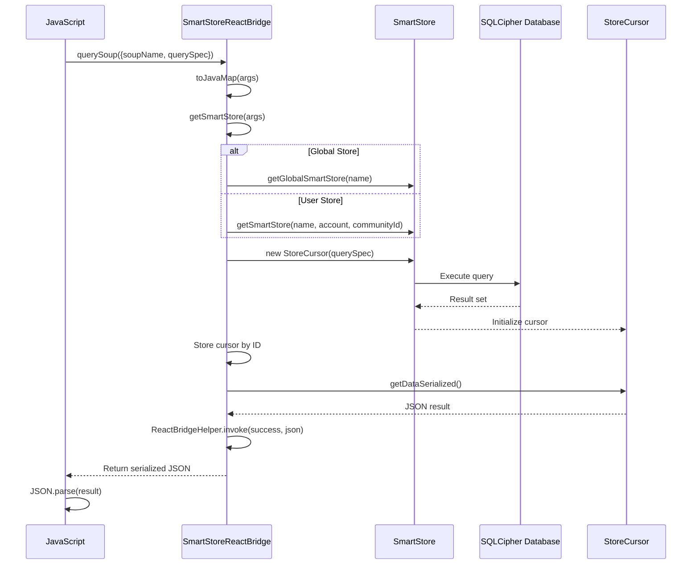

### MobileSync Sync Flow

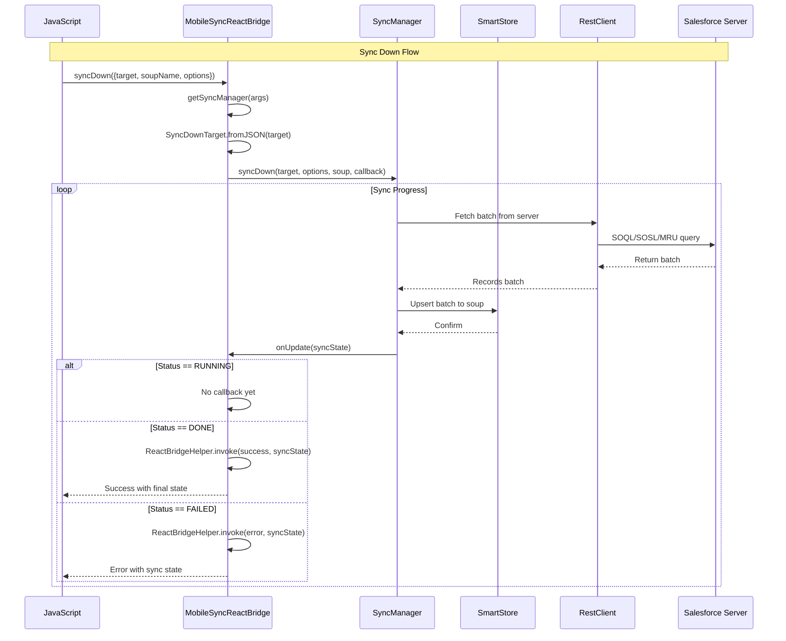

### REST Request Flow

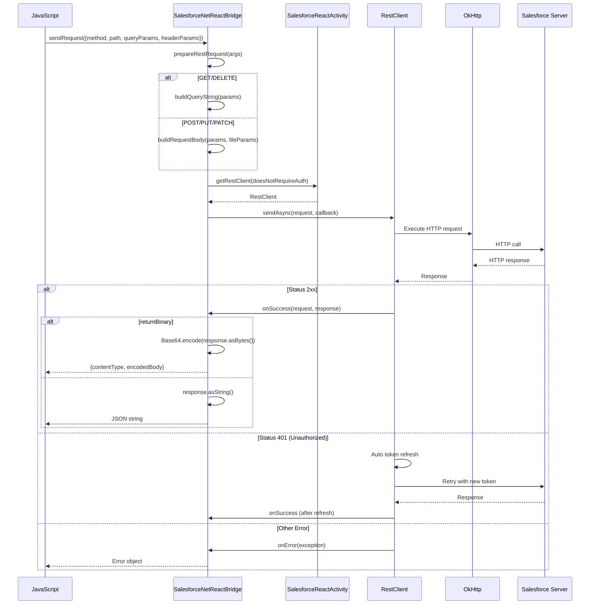

## Lifecycle Management

### Activity Lifecycle Integration

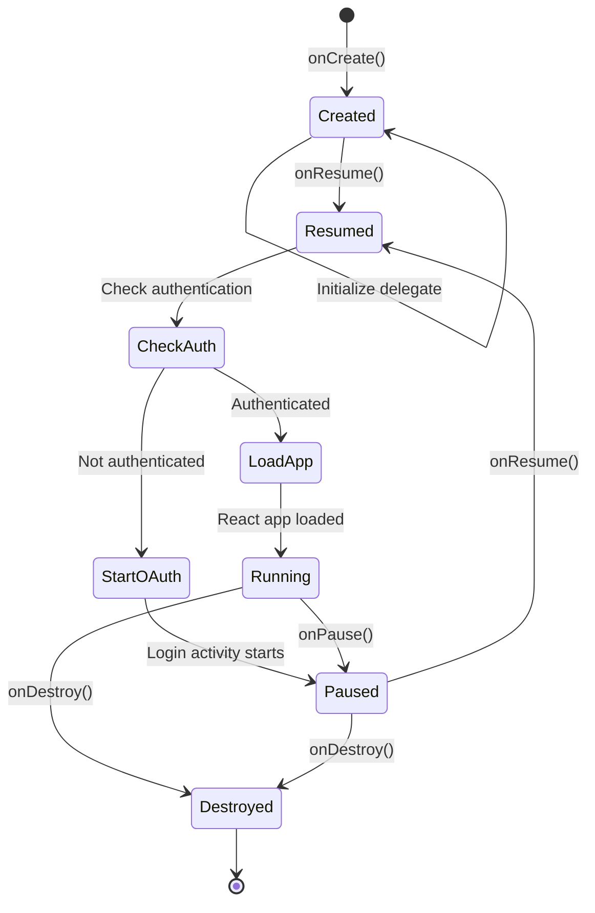

### React App Loading Control

The `SalesforceReactActivityDelegate` ensures React app loads only when ready:

```java
public void loadReactAppOnceIfReady(String appKey) {
    if (!loaded && salesforceReactActivity != null 
        && salesforceReactActivity.shouldReactBeRunning()) {
        super.loadApp(appKey);
        loaded = true;
        super.onResume();
    }
}

protected boolean shouldReactBeRunning() {
    // Wait for overlay permission in dev mode
    // Wait for authentication if required
    return !shouldAskOverlayPermission() 
        && (!shouldAuthenticate() || client != null);
}
```

This prevents React Native from loading before:
1. Developer overlay permissions are granted (dev mode)
2. OAuth authentication completes (if required)

## Threading Model

### Thread Responsibilities

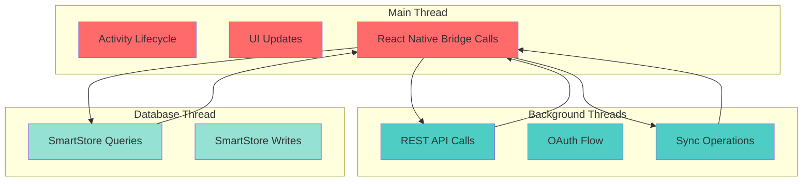

### Synchronization Patterns

**SmartStore Database Lock:**
```java
synchronized(smartStore.getDatabase()) {
    smartStore.beginTransaction();
    try {
        // Multiple operations in transaction
        smartStore.upsert(soupName, entry1);
        smartStore.upsert(soupName, entry2);
        smartStore.setTransactionSuccessful();
    } finally {
        smartStore.endTransaction();
    }
}
```

**Static Cursor Management:**
```java
private static Map<SQLiteDatabase, SparseArray<StoreCursor>> STORE_CURSORS = 
    new HashMap<>();

private synchronized static SparseArray<StoreCursor> getSmartStoreCursors(SmartStore store) {
    final SQLiteDatabase db = store.getDatabase();
    if (!STORE_CURSORS.containsKey(db)) {
        STORE_CURSORS.put(db, new SparseArray<>());
    }
    return STORE_CURSORS.get(db);
}
```

## Storage Architecture

### SmartStore Multi-Store Support

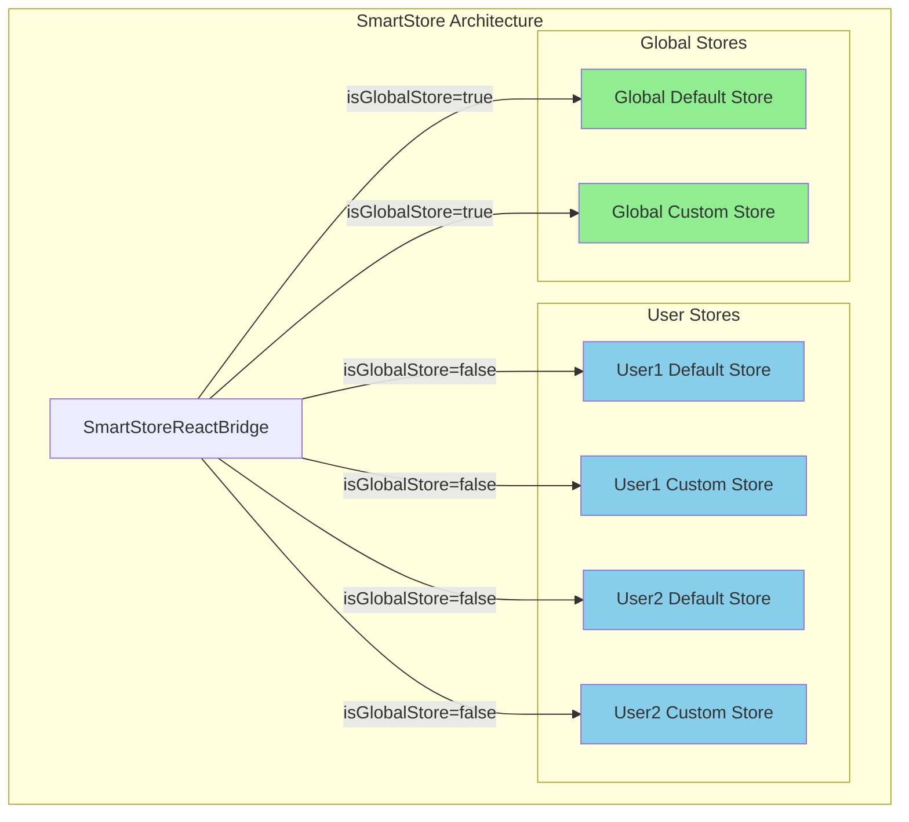

### Store Resolution Logic

```java
public static SmartStore getSmartStore(ReadableMap args) throws Exception {
    boolean isGlobal = getIsGlobal(args);
    final String storeName = getStoreName(args);
    
    if (isGlobal) {
        return SmartStoreSDKManager.getInstance()
            .getGlobalSmartStore(storeName);
    } else {
        final UserAccount account = UserAccountManager.getInstance()
            .getCachedCurrentUser();
        if (account == null) {
            throw new Exception("No user account found");
        }
        return SmartStoreSDKManager.getInstance()
            .getSmartStore(storeName, account, account.getCommunityId());
    }
}
```

### Cursor Management

Cursors enable pagination of large query results:

```java
// Create cursor and cache it
final StoreCursor storeCursor = new StoreCursor(smartStore, querySpec);
getSmartStoreCursors(smartStore).put(storeCursor.cursorId, storeCursor);

// Return first page
JSONObject result = storeCursor.getDataSerialized(smartStore);

// Later: move to different page
StoreCursor cached = getSmartStoreCursors(smartStore).get(cursorId);
cached.moveToPageIndex(pageIndex);
JSONObject page = cached.getDataSerialized(smartStore);

// Close cursor when done
getSmartStoreCursors(smartStore).remove(cursorId);
```

## Error Handling Patterns

### Bridge Error Propagation

```java
try {
    // Perform operation
    JSONObject result = performOperation(args);
    ReactBridgeHelper.invoke(successCallback, result);
} catch (Exception e) {
    SalesforceReactLogger.e(TAG, "Operation failed", e);
    errorCallback.invoke(e.toString());
}
```

### REST Error Handling

```java
@Override
public void onSuccess(RestRequest request, RestResponse response) {
    // Check HTTP status
    if (!response.isSuccess()) {
        JSONObject errorObject = new JSONObject();
        errorObject.put("headers", response.getAllHeaders());
        errorObject.put("statusCode", response.getStatusCode());
        errorObject.put("body", parsedResponse(response));
        
        JSONObject error = new JSONObject();
        error.put("response", errorObject);
        errorCallback.invoke(error.toString());
    } else {
        successCallback.invoke(response.asString());
    }
}
```

## Performance Considerations

### Bridge Communication Overhead

- **String serialization**: JSON objects are serialized to strings for bridge crossing
- **Callback invocation**: Each callback requires bridge traversal
- **Large data sets**: Use pagination (cursors) for large query results

### Optimization Strategies

1. **Batch operations**: Use transactions for multiple SmartStore writes
2. **Cursor pagination**: Avoid loading entire result sets into memory
3. **Async operations**: All I/O is asynchronous to prevent blocking
4. **Connection pooling**: RestClient reuses OkHttp connections

## Future Architecture Considerations

### New Architecture Migration

React Native's "New Architecture" introduces:
- **TurboModules**: Lazy-loaded native modules with type safety
- **Fabric**: New rendering system
- **JSI**: JavaScript Interface for direct JS ↔ Native communication

Migration would involve:
1. Converting `ReactContextBaseJavaModule` to `TurboModule`
2. Defining TypeScript specs for type safety
3. Replacing callback pattern with promises/async-await
4. Direct object passing instead of string serialization

### Codegen Specifications

Example TurboModule spec:
```typescript
export interface Spec extends TurboModule {
  authenticate(): Promise<Credentials>;
  getAuthCredentials(): Promise<Credentials>;
  logout(): Promise<void>;
}
```

## Summary

The SalesforceReact architecture provides a robust bridge between React Native and native Salesforce SDK functionality through:

- **Layered design** separating concerns across bridge, activity, and SDK layers
- **Callback coordination** ensuring reliable async operation handling
- **Multi-store support** for user-specific and global data
- **Thread-safe operations** with proper synchronization
- **Lifecycle awareness** coordinating authentication with app loading

This architecture enables React Native developers to access the full power of Salesforce Mobile SDK while maintaining a clean separation between JavaScript and native code.
