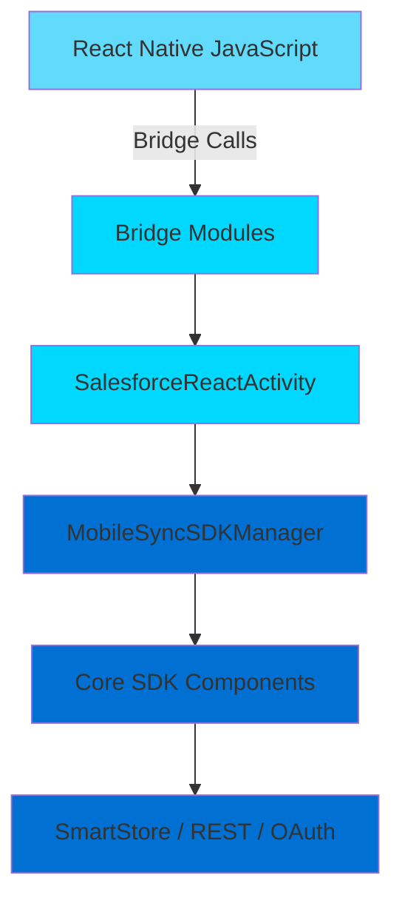
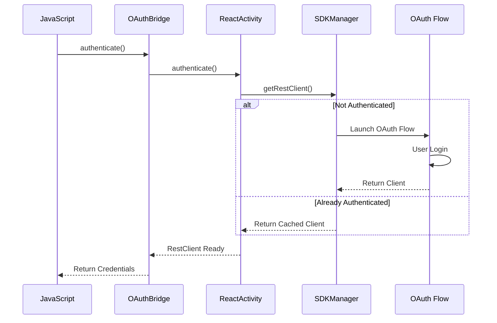

# SalesforceReact Library

> **MOVED**: As of SDK 14.0, the SalesforceReact bridge code has moved from this repository (`libs/SalesforceReact/`) to the `SalesforceMobileSDK-ReactNative` repository (`android/` directory). This enables React Native autolinking and unifies all bridge code (iOS + Android + JavaScript) in a single repo. See `SalesforceMobileSDK-ReactNative/CLAUDE.md` for the current architecture.
>
> What remains in this repo: `SalesforceReactActivity` and `SalesforceReactSDKManager` (app/UI layer), which are dependencies of the bridge code in the ReactNative repo.

The SalesforceReact library provides React Native integration for the Salesforce Mobile SDK on Android. It enables developers to build React Native applications that leverage Salesforce authentication, data storage, synchronization, and REST API capabilities.

## Overview

SalesforceReact acts as a bridge between React Native JavaScript code and native Android implementations of Salesforce Mobile SDK features. It exposes native functionality to JavaScript through React Native's bridge architecture, allowing React Native apps to access:

- **OAuth Authentication**: Complete Salesforce OAuth2 flow with automatic token management
- **SmartStore**: Encrypted local data storage with SQL-like querying
- **MobileSync**: Bidirectional data synchronization between device and Salesforce cloud
- **REST API**: Authenticated REST calls to Salesforce APIs

## Key Features

- **Seamless Authentication**: Automatic OAuth2 flow with token refresh handling
- **Encrypted Storage**: SQLCipher-backed SmartStore for secure local data
- **Offline-First Sync**: MobileSync for reliable data sync with conflict resolution
- **React Native Bridge**: Type-safe JavaScript API that maps to native Android functionality
- **Activity Lifecycle Management**: Proper handling of Android activity states and authentication flows
- **Development Support**: Integration with React Native developer tools

## Library Structure

```
SalesforceReact/
├── src/com/salesforce/androidsdk/reactnative/
│   ├── app/              # SDK initialization and lifecycle management
│   │   ├── SalesforceReactSDKManager.java
│   │   └── SalesforceReactUpgradeManager.java
│   ├── bridge/           # React Native bridge modules
│   │   ├── SalesforceOauthReactBridge.java
│   │   ├── SmartStoreReactBridge.java
│   │   ├── MobileSyncReactBridge.java
│   │   ├── SalesforceNetReactBridge.java
│   │   └── ReactBridgeHelper.java
│   ├── ui/               # Activity components
│   │   ├── SalesforceReactActivity.java
│   │   └── SalesforceReactActivityDelegate.java
│   └── util/             # Utilities
│       └── SalesforceReactLogger.java
```

## Architecture

The library follows a layered architecture:



1. **JavaScript Layer**: React Native code calls JavaScript APIs
2. **Bridge Layer**: Native modules expose methods via `@ReactMethod` annotations
3. **Activity Layer**: `SalesforceReactActivity` manages lifecycle and authentication
4. **SDK Manager Layer**: `SalesforceReactSDKManager` coordinates SDK components
5. **Core SDK Layer**: Underlying Salesforce Mobile SDK libraries (SalesforceSDK, SmartStore, MobileSync)

## Dependencies

SalesforceReact has an `api` dependency on `MobileSync`, which transitively pulls in:

```
SalesforceReact
  └── MobileSync
       └── SmartStore
            └── SalesforceSDK
                 └── SalesforceAnalytics
```

**External dependencies**:
- **React Native**: JavaScript runtime and bridge infrastructure (currently `react-android:0.79.3`; alignment to `0.81.5` planned)

**Note on Language**: The bridge modules are currently written in Java. Per project guidelines, new code should be Kotlin and a Kotlin migration is planned; existing Java files remain for now.

## Getting Started

### Initialization

Initialize the SDK in your Application class:

```java
public class MainApplication extends Application {
    @Override
    public void onCreate() {
        super.onCreate();
        SalesforceReactSDKManager.initReactNative(
            getApplicationContext(),
            MainActivity.class
        );
    }
}
```

### Main Activity

Extend `SalesforceReactActivity`:

```java
public class MainActivity extends SalesforceReactActivity {
    
    @Override
    protected String getMainComponentName() {
        return "YourAppName";
    }
    
    @Override
    public boolean shouldAuthenticate() {
        return true; // Require login on app start
    }
}
```

### JavaScript Usage

Access native functionality from JavaScript. The SDK uses **callback-based** APIs (`success`, `error`):

```javascript
import { oauth, net, smartstore, mobilesync } from 'react-native-force';

// Authenticate
oauth.authenticate(
  (credentials) => { /* success */ },
  (error) => { /* error */ }
);

// Make REST call - net.sendRequest uses callbacks
net.sendRequest(
  '/services/data',
  '/v60.0/sobjects/Account',
  (response) => { /* success */ },
  (error) => { /* error */ }
);

// Register soup
smartstore.registerSoup(
  false, // isGlobalStore
  'accounts',
  [{path: 'Id', type: 'string'}],
  (soupName) => { /* success */ },
  (error) => { /* error */ }
);

// Sync down
mobilesync.syncDown(
  false, // isGlobalStore
  {type: 'soql', query: 'SELECT Id, Name FROM Account'},
  'accounts',
  {mergeMode: 'OVERWRITE'},
  null, // syncName
  (syncResult) => { /* success */ },
  (error) => { /* error */ }
);
```

For Promise-based wrappers, use `forceUtil.promiser` from `react-native-force`.

## Key Components

### SalesforceReactSDKManager

Singleton manager that:
- Initializes the React Native SDK environment
- Registers React Native bridge modules
- Manages app lifecycle
- Provides access to ReactPackage for bridge registration

### SalesforceReactActivity

Base activity for React Native apps that:
- Handles OAuth authentication flow
- Manages activity lifecycle (onCreate, onResume, onPause, onDestroy)
- Provides RestClient access to bridge modules
- Controls when React Native app loads (after authentication)
- Integrates React Native developer tools

### Bridge Modules

Four `@ReactMethod`-bearing bridge modules expose native functionality:

1. **SalesforceOauthReactBridge**: Authentication and credentials
2. **SmartStoreReactBridge**: Local database operations
3. **MobileSyncReactBridge**: Data synchronization
4. **SalesforceNetReactBridge**: REST API calls

A fifth class, **`ReactBridgeHelper`**, is a utility used by the bridge modules to convert between React Native types (`ReadableMap`, `ReadableArray`) and Java/JSON.

## Authentication Flow



## Data Flow

The library uses callbacks to communicate asynchronous results:


## Development and Debugging

### React Native Dev Menu

Access the developer menu in debug builds:
- Shake device or press Cmd+M (emulator)
- SalesforceReactActivity integrates with React Native's DevSupportManager

### Logging

Use `SalesforceReactLogger` for consistent logging:

```java
SalesforceReactLogger.i(TAG, "Info message");
SalesforceReactLogger.e(TAG, "Error message", exception);
```

## Thread Safety

- **Bridge calls**: Run on React Native bridge thread
- **SmartStore operations**: Use database-level synchronization
- **REST calls**: Asynchronous with callback on completion
- **Authentication**: Coordinated via pending callback mechanism

## Upgrade Management

`SalesforceReactUpgradeManager` handles SDK version migrations:
- Extends `MobileSyncUpgradeManager`
- Automatically runs on SDK initialization
- Ensures data compatibility across versions

## Related Documentation

- [Architecture Details](ARCHITECTURE.md)
- [API Reference](API_REFERENCE.md)
- [Testing Guide](TESTING.md)
- [Android Javadoc](https://forcedotcom.github.io/SalesforceMobileSDK-Android/index.html)
- [Mobile SDK Development Guide](https://developer.salesforce.com/docs/platform/mobile-sdk/guide)

## Contributing

When modifying SalesforceReact:

1. Maintain backward compatibility for public bridge methods
2. Follow deprecation cycle for API changes
3. Add comprehensive logging for troubleshooting
4. Test authentication flows thoroughly (already logged in, OAuth required, token refresh)
5. Ensure thread safety for async operations
6. Update both Android and iOS implementations for consistency

## License

Copyright (c) 2014-present, salesforce.com, inc.
See source files for full BSD 3-Clause license text.
