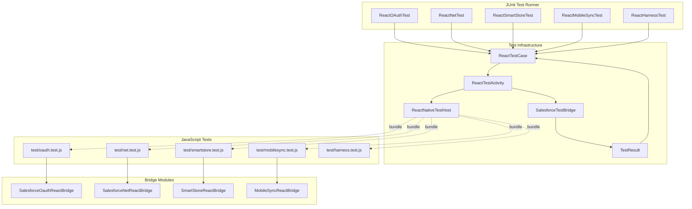

# SalesforceReact Testing Guide

This guide describes the test infrastructure for the SalesforceReact library in the SalesforceMobileSDK-Android repository.

## Table of Contents

- [Overview](#overview)
- [Test Architecture](#test-architecture)
- [Test Files](#test-files)
- [Running Tests](#running-tests)
- [How Tests Work](#how-tests-work)
- [Test Bridge](#test-bridge)
- [Adding New Tests](#adding-new-tests)
- [CI/CD Integration](#cicd-integration)
- [Troubleshooting](#troubleshooting)

## Overview

The SalesforceReact library tests run JavaScript test code through a real React Native test app. This is the same pattern used by iOS tests (see `iosTests/` in SalesforceMobileSDK-ReactNative).

**Test execution flow:**
```
JUnit (Android)
  └── ReactTestActivity (loads React Native bundle)
       └── React Native runtime
            └── JavaScript test (test/*.test.js from ReactNative repo)
                 └── Bridge module (Java) → Salesforce SDK
                      └── TestResult reported back to JUnit
```

Tests exercise the real bridge end-to-end: the JavaScript test calls the bridge module via `NativeModules`, the Java bridge invokes Salesforce SDK methods, and results flow back through the bridge. There are no unit tests with mocked bridges - tests verify real integration behavior.

## Test Architecture



## Test Files

**Location**: `libs/test/SalesforceReactTest/`

```
libs/test/SalesforceReactTest/
├── AndroidManifest.xml
├── proguard.cfg
├── assets/
│   ├── index.android.bundle              # Pre-bundled JavaScript tests
│   └── drawable-mdpi/                    # React Native assets
├── res/
│   ├── layout/main.xml                   # Test activity layout
│   ├── values/bootconfig.xml             # SDK OAuth configuration
│   ├── values/strings.xml
│   └── xml/servers.xml
└── src/com/salesforce/androidsdk/reactnative/
    ├── ReactTestCase.java                # Base test class
    ├── ReactOAuthTest.java               # OAuth tests
    ├── ReactNetTest.java                 # REST API tests
    ├── ReactSmartStoreTest.java          # SmartStore tests
    ├── ReactMobileSyncTest.java          # MobileSync tests
    ├── ReactHarnessTest.java             # Test harness tests
    ├── bridge/
    │   └── SalesforceTestBridge.java     # Bridge module for test results
    └── util/
        ├── ReactTestActivity.java        # Activity that runs tests
        ├── ReactNativeTestHost.java      # ReactNativeHost for tests
        ├── ReactActivityTestDelegate.java
        ├── SalesforceReactTestApp.java   # Test Application class
        ├── SalesforceReactTestPackage.java # Registers test bridge
        └── TestResult.java               # Test result holder
```

**Test source set configuration** in `libs/SalesforceReact/build.gradle.kts`:
```kotlin
sourceSets {
    getByName("androidTest") {
        setRoot("../test/SalesforceReactTest")
        java.directories.add("../test/SalesforceReactTest/src")
        resources.directories.add("../test/SalesforceReactTest/src")
        res.directories.add("../test/SalesforceReactTest/res")
    }
}
```

## Running Tests

### Prerequisites

1. **Test credentials**: Place a populated `test_credentials.json` in `shared/test/` (gitignored)
2. **Connected device or emulator**: Tests are instrumented (run on a device)
3. **Android SDK environment**: Configured per main repo CLAUDE.md

### Run All SalesforceReact Tests

```bash
cd SalesforceMobileSDK-Android
./gradlew :libs:SalesforceReact:connectedAndroidTest
```

### Run with Coverage

```bash
./gradlew :libs:SalesforceReact:connectedAndroidTest jacocoTestReport
```

Coverage report: `libs/SalesforceReact/build/reports/jacoco/jacocoTestReport/html/index.html`

### Run a Single Test Class

```bash
./gradlew :libs:SalesforceReact:connectedAndroidTest \
  -Pandroid.testInstrumentationRunnerArguments.class=com.salesforce.androidsdk.reactnative.ReactOAuthTest
```

### CI Execution

Tests run via existing Android CI workflows (`.github/workflows/`):
- **PR workflow**: Runs tests for libs that changed
- **Nightly workflow**: Runs tests for all libs including SalesforceReact

## How Tests Work

### 1. Test Class Pattern

Each test class extends `ReactTestCase` and uses parameterized JUnit to map JavaScript test names to Java test methods.

**Example**: `ReactOAuthTest.java`
```java
@RunWith(Parameterized.class)
@SmallTest
public class ReactOAuthTest extends ReactTestCase {

    @Parameterized.Parameter
    public String testName;

    @Parameterized.Parameters(name = "{0}")
    public static List<String> data() {
        return Arrays.asList("testGetAuthCredentials");
    }

    @Test
    public void test() throws Exception {
        runReactNativeTest(testName);
    }
}
```

The `@Parameterized.Parameters` list contains the JavaScript test function names. Each name becomes a separate JUnit test invocation.

### 2. Test Execution

`ReactTestCase.runReactNativeTest()` launches `ReactTestActivity` with the test name as an Intent extra:

```java
protected void runReactNativeTest(String testName) throws InterruptedException {
    TestResult result = getTestResult(testName);
    if (result == null) {
        Assert.fail(testName + " timed out");
    } else {
        Assert.assertTrue(result.message, result.status);
    }
}
```

The activity loads the React Native bundle, invokes the named JavaScript test, and the JS test reports its result through the test bridge.

### 3. Pre-bundled JavaScript

`assets/index.android.bundle` contains the pre-bundled JavaScript test suite from `SalesforceMobileSDK-ReactNative/test/`. This bundle is updated when JavaScript tests change.

## Test Bridge

`SalesforceTestBridge.java` is a React Native bridge module that JavaScript tests use to report results back to native code.

**Bridge usage from JavaScript** (in `react.force.test.tsx` from ReactNative repo):
```javascript
const SalesforceTestBridge = NativeModules.SalesforceTestBridge;

export const testDone = (success, message) => {
  SalesforceTestBridge.testDone(success, message);
};
```

**Native side** (`SalesforceTestBridge.java`) signals `TestResult` which `ReactTestCase` is waiting on.

## Adding New Tests

### 1. Add JavaScript Test

In `SalesforceMobileSDK-ReactNative/test/<module>.test.js`:
```javascript
function testNewFeature() {
  oauth.getAuthCredentials(
    (credentials) => {
      // ... assertions ...
      testDone(true, 'Test passed');
    },
    (error) => {
      testDone(false, error.message);
    }
  );
}

registerTest(testNewFeature);
```

### 2. Re-bundle JavaScript

Update the pre-bundled JS in the Android repo:
```bash
# In SalesforceMobileSDK-ReactNative repo
cd iosTests
./updatebundle.js  # produces ios/index.ios.bundle and android-side bundles

# Copy the Android bundle to Android repo
cp <android-bundle> ../../SalesforceMobileSDK-Android/libs/test/SalesforceReactTest/assets/index.android.bundle
```

(Refer to current scripts; bundle update process varies by tooling version.)

### 3. Add Test Name to Java Test Class

In `ReactOAuthTest.java`:
```java
@Parameterized.Parameters(name = "{0}")
public static List<String> data() {
    return Arrays.asList(
        "testGetAuthCredentials",
        "testNewFeature"  // Added
    );
}
```

### 4. Run Tests

```bash
./gradlew :libs:SalesforceReact:connectedAndroidTest
```

## CI/CD Integration

### Existing Android CI

The Android repo's `.github/workflows/` already handles SalesforceReact tests:
- Tests run on PRs that modify `libs/SalesforceReact/` or its dependencies
- Tests run nightly on all libs
- Tests execute on Firebase Test Lab (real or virtual devices)
- Results uploaded to Codecov for coverage tracking

### Test Credentials

Test credentials are provisioned via:
- **CI**: `TEST_CREDENTIALS` GitHub secret
- **Local**: Place populated `test_credentials.json` in `shared/test/`

## Troubleshooting

### Tests Fail with "ReactTestActivity timed out"

**Causes**:
- React Native bundle didn't load correctly
- JavaScript test threw uncaught exception
- Test waiting on async operation that never completes

**Solutions**:
1. Check device/emulator logs (`adb logcat`) for JavaScript errors
2. Verify `index.android.bundle` is up-to-date in test assets
3. Check `TestResult` timeout (default 120s in `ReactTestCase`)

### Tests Fail with "Not authenticated"

**Cause**: Test credentials missing or invalid

**Solution**:
1. Verify `shared/test/test_credentials.json` exists and is populated
2. For CI: Verify `TEST_CREDENTIALS` secret is configured

### Bundle Out of Date

**Symptom**: Tests pass on iOS but fail on Android (or vice versa)

**Cause**: `index.android.bundle` was not regenerated after JS test changes

**Solution**: Re-bundle JavaScript tests and copy to `libs/test/SalesforceReactTest/assets/`

### Build Failures with React Native Codegen

**Cause**: React Native version mismatch between Android repo (currently `react-android:0.79.3`) and JS-side `react-native:0.81.5`

**Solution**: Tracked as a separate item; will be resolved in upcoming new-architecture migration work.

## Related Documentation

- [SalesforceReact README](./README.md) - Library overview
- [SalesforceReact ARCHITECTURE](./ARCHITECTURE.md) - Architecture details
- [SalesforceReact API_REFERENCE](./API_REFERENCE.md) - Bridge module APIs
- [iOS Test Setup](../../../SalesforceMobileSDK-ReactNative/docs/ios-tests/README.md) - iOS test infrastructure (mirror pattern)
